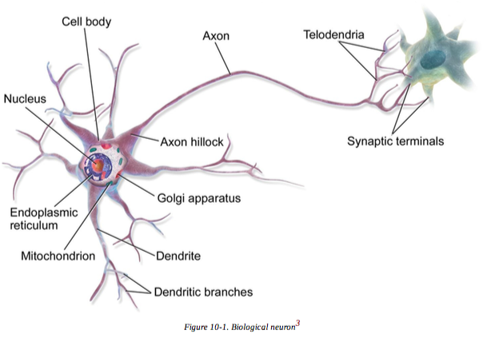
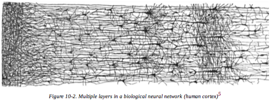
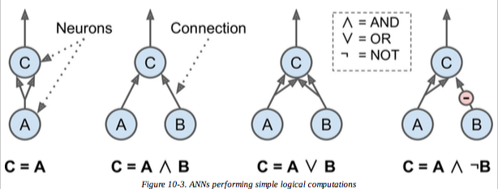
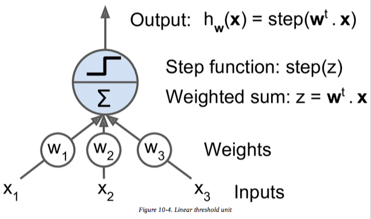

<!DOCTYPE html>
<html>
  <head>
    <title>Title</title>
    <meta charset="utf-8">
    <style>
      @import url(https://fonts.googleapis.com/css?family=Yanone+Kaffeesatz);
      @import url(https://fonts.googleapis.com/css?family=Droid+Serif:400,700,400italic);
      @import url(https://fonts.googleapis.com/css?family=Ubuntu+Mono:400,700,400italic);

      body { font-family: 'Droid Serif'; }
      h1, h2, h3 {
        font-family: 'Yanone Kaffeesatz';
        font-weight: normal;
      }
      .remark-code, .remark-inline-code { font-family: 'Ubuntu Mono'; }
    </style>
  </head>
  <body>
    <textarea id="source">

class: center, middle


# LS 387 Artificial Neural Networks and Deep Learning for Natural Language Processing
_Wednesday_: 9:00 - 11:00
_Friday_: 11:00 - 1:00

_Venue_: CL Lab (117)

_Instructor_: [Dr. Indranil Dutta](duttalab.github.io)

---
# Introduction
Artificial neural networks have near revolutionized big data analytics. In this course we will apply deep learning to some speech and natural language processing tasks. Students will be exposed to various types of network architectures such as Convolutional Neural Networks, Recurrent Neural Networks, Autoencoders, LSTMs, Generalized Adversarial Networks. We will also learn to execute training and testing data with these architectures with TensorFlow. 

---
# Reading material
1. *Hands-On Machine Learning with Scikit-Learn
and TensorFlow Concepts, Tools, and Techniques to Build Intelligent Systems*. Aurélien Géron
2. *Deep Learning with Python*. François Chollet


---
#Evaluation
40%  | 60%
------------- | -------------
3 class presentations|Final project and presentation

---
# What do we mean by neural networks?
* Biological neurons
	1. Unusual-looking cell composed of a cell body containing the nucleus
	2. Many branching extensions called *dendrites*, 
	3. One long extension called the axon. 
	4. When a neuron receives a sufficient number of signals from other neurons within a few milliseconds, it fires its own signals.


---
# Biological Neural Networks (BNNS)
* Biological neurons are organized in a vast network of billions of neurons
* Each neuron connected to thousands of other neurons. 
* Highly complex computations can be performed by a vast network of fairly simple neurons
* Architecture of biological neural networks (BNN)



---
# Computations
* [Warren McCulloch and Walter Pitts](http://www.cse.chalmers.se/~coquand/AUTOMATA/mcp.pdf) - simple model of the biological neuron
* It has one or more binary (on/off) inputs and one binary output. 
* The artificial neuron simply activates its output when more than a certain number of its inputs are active.
* [Warren McCulloch and Walter Pitts](http://www.cse.chalmers.se/~coquand/AUTOMATA/mcp.pdf) show that it is possible to build a network of artificial neurons that computes any logical proposition you want.

	
---
## Logical computations


* Identity network
* Logical **AND**
* Logical **OR**
* Inhibition


---

#The common perceptron
* [Rosenblatt's perceptron](https://blogs.umass.edu/brain-wars/files/2016/03/rosenblatt-1957.pdf)
* *Linear Threshold Unit (LTU)**



---
# Readings for Wednesday
* [Warren McCulloch and Walter Pitts](http://www.cse.chalmers.se/~coquand/AUTOMATA/mcp.pdf)
* [Rosenblatt's perceptron](https://blogs.umass.edu/brain-wars/files/2016/03/rosenblatt-1957.pdf)
* Chapter 10 from *Hands-On Machine Learning with Scikit-Learn and TensorFlow Concepts, Tools, and Techniques to Build Intelligent Systems*. Aurélien Géron
* *Neuronal Dynamics* [Chapter 1](http://neuronaldynamics.epfl.ch/online/Pt1.html)

---
# [Warren McCulloch and Walter Pitts](http://www.cse.chalmers.se/~coquand/AUTOMATA/mcp.pdf), 1943. *Bulletin of Mathematical Biophysics*, Vol. 5, pp. 115-133
## Major assumptions
* "all-or-none" process
* Fixed number of synapses have to be excited within the period of latent addition to excite a neuron.
* Only synaptic delay is significant
* Inhibitory synapse prevents excitation at a particular time
* Structure of the net doesn't change with time

---
# Perceptron
* A single layer of LTUs
* Each neuron connected to all inputs
* They output whatever they are fed; *passthrough*
* Bias feature $ x_{0} $ = 1, always outputs 1

---
# Perceptron training
* **Hebb's rule**
* "*...the connection weight between two neurons is increased whenever they have the same output...*"
* Wrong outputs are not reinforced
* $W_{i,j}$^(next step) = $W_{i,j}$ + n( $\hat{y}_{j}$ - $y_{j}$)$x_{i}$

---
# Perceptron training
* $W_{i,j}$^(next step) = $W_{i,j}$ + n( $\hat{y}_{j}$ - $y_{j}$)$x_{i}$, here
	* $W_{i,j}$ is the connection weight between the i^th input neuron and the j^th output neuron
	* $x_{i}$ is the i^th input of the current training instance
	* $\hat{y}_{j}$ is the j^th output neuron for the current training instance
	* $y_{j}$ is the target output neuron for the current training instance
	* n is the learning rate

---
#Iris dataset
```python
import numpy as np from sklearn.datasets import load_iris 
from sklearn.linear_model import Perceptron
iris = load_iris()
X = iris.data[:, (2, 3)] # petal length, petal width y = (iris.target == 0).astype(np.int) # Iris Setosa?
per_clf = Perceptron(random_state=42) per_clf.fit(X, y)
y_pred = per_clf.predict([[2, 0.5]])
```
---
#Multi-layer perceptrons
* One pass-through input layer
* One or more layers of LTUs or *hidden layers*

</textarea>
    <script src="https://remarkjs.com/downloads/remark-latest.min.js">
    </script>
    <script>
    var slideshow = remark.create({
  sourceUrl: 'lectures.md'
});
    </script>
  </body>
</html>