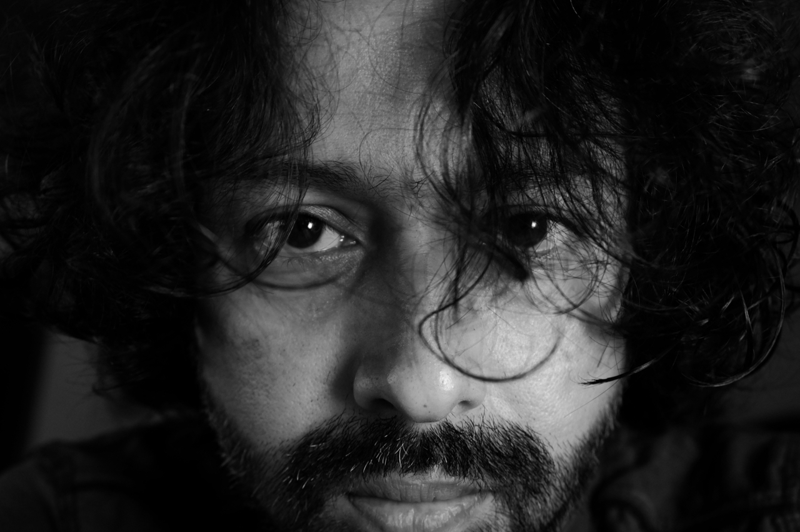

## Short Bio
Dr. Indranil Dutta has a PhD in Linguistics from the [Department of Linguistics](http://www.linguistics.illinois.edu/) at the [University of Illinois at Urbana-Champaign](http://illinois.edu/).

[@academicmargin](https://twitter.com/academicmargin)
