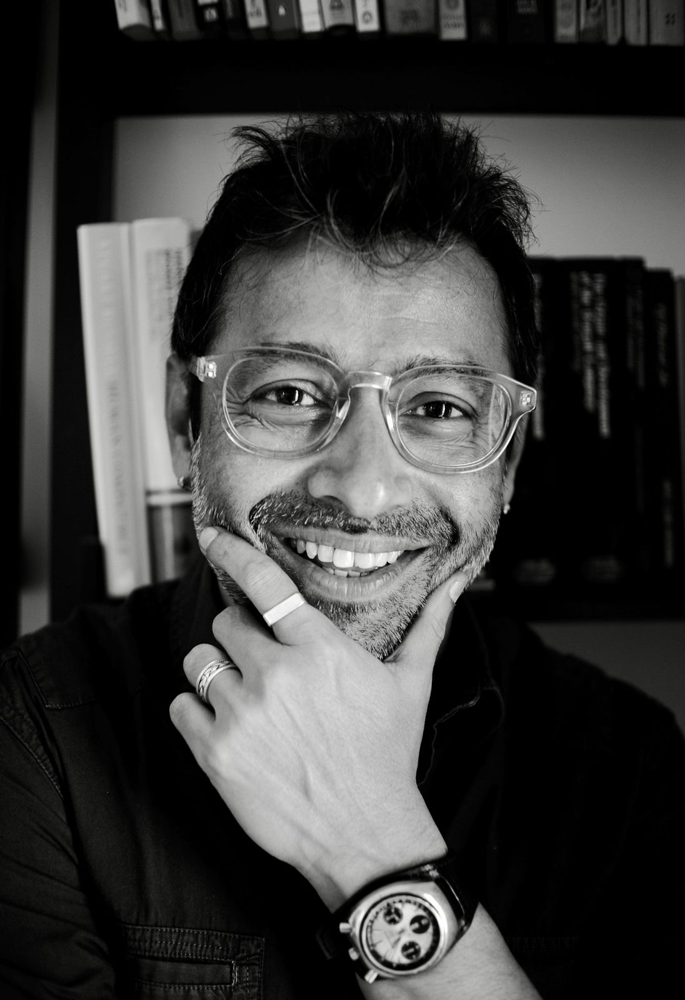

	    

**Indranil Dutta**

I am computational linguist with interests in speech acoustics, motor control, and automatic methods of grammar induction. My research spans areas within acoustic phonetics, computational phonology, and natural language processing. Within the Speech Dynamics Laboratory (*SpeeDyLab*) at Jadavpur University, we are interested in articulatory imaging and modeling, and understanding how the dynamics of speech production and perception systems seamlessly integrate within a unified embodied cognition framework. With paradigms ranging from Ultrasound imaging, computational modeling, and eye-tracking, The *SpeeDylab* is focussed on uncovering links between speech production and perception, and learning how these links provide insight into reading-related complexities. I earned a PhD in linguistics from the [University of Illinois at Urbana-Champaign](http://illinois.edu/) and taught at [Rice University](www.rice.edu), Houston, TX between 2008 and 2010 and the [Department of Computational Linguistics](http://www.efluniversity.ac.in/computational_linguistic.php), at [The English and Foreign Languages university](http://www.efluniversity.ac.in/). Since June 2020, I have been a Professor at the [School of Languages and Linguistics](http://www.jaduniv.edu.in/view_department.php?deptid=143) at [Jadavpur University](http://www.jaduniv.edu.in/), Kolkata

* Google scholar profile can be found [here](https://scholar.google.co.in/citations?user=i3fWqy4AAAAJ&hl=en). 
* I am on Bluesky [@academicmargin](https://bsky.app/profile/academicmargin.bsky.social).

<!-- [#KnowCoDA](KnowCoDA.md) -->

